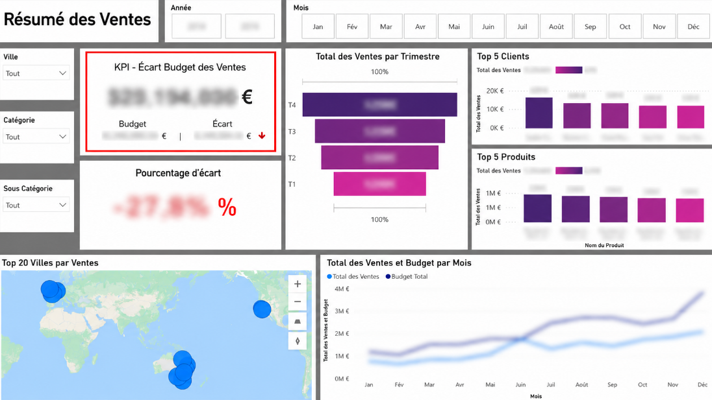

# Tableau de Bord de Performance des Ventes

## Description du Projet

Ce tableau de bord Power BI a été conçu pour analyser et suivre la performance commerciale d'une entreprise en comparant les ventes réalisées aux objectifs budgétaires définis.

Grâce à des visualisations interactives et des indicateurs clés de performance (KPI), il permet aux décideurs de surveiller les résultats, d'identifier les écarts par rapport aux objectifs et de mieux comprendre les facteurs qui influencent la performance des ventes.

## Fonctionnalités Principales

### KPI Ventes vs Budget
- Affichage du montant total des ventes.
- Comparaison avec le budget prévu.
- Calcul de l'écart en valeur et en pourcentage afin d'évaluer rapidement la performance.

### Analyse Trimestrielle des Ventes
- Comparaison des ventes par trimestre.
- Identification des périodes les plus performantes.

### Top 5 Clients
- Identification des clients générant le plus de chiffre d'affaires.
- Mise en évidence des clients stratégiques pour l'entreprise.

### Top 5 Produits
- Classement des produits les plus vendus.
- Analyse de leur contribution au chiffre d'affaires global.

### Répartition Géographique des Ventes
- Visualisation des ventes par ville grâce à une carte interactive.
- Identification des marchés les plus performants.

### Analyse Mensuelle des Ventes et du Budget
- Suivi de l'évolution des ventes au fil des mois.
- Comparaison entre les performances réelles et les objectifs budgétaires.

### Filtres Interactifs
Le tableau de bord permet de filtrer les données selon plusieurs dimensions :
- Année
- Mois
- Ville
- Catégorie
- Sous-catégorie

## Objectif Métier

L'objectif principal de ce tableau de bord est d'aider les responsables commerciaux et les décideurs à piloter efficacement l'activité en fournissant une vision claire des performances, des écarts budgétaires et des opportunités d'amélioration.

## Compétences Démontrées

- Développement de tableaux de bord Power BI
- Modélisation de données
- Création de mesures DAX
- Conception de KPI
- Business Intelligence
- Analyse de la performance commerciale
- Visualisation de données
- Data Storytelling
## Aperçu du Dashboard

## Aperçu du Dashboard

